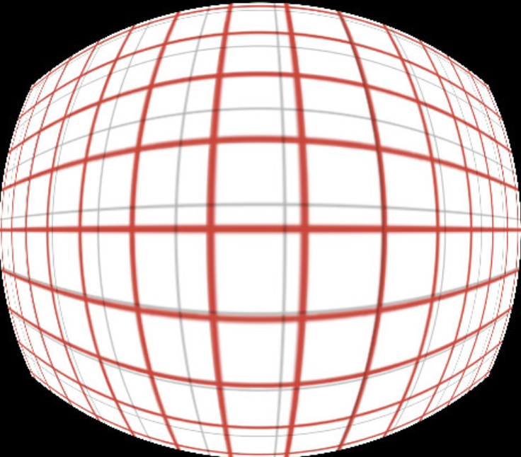
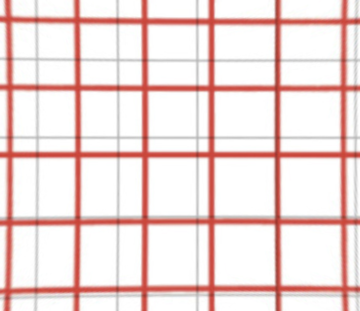

# Fix Distortion

A lightweight and efficient javascript package for correcting various types of image distortions.


## Installation

```
npm install fix-distortion
```
## Example
<table>
  <tr>
    <td>Before</td>
    <td>After</td>
  </tr>
  <tr>
    <td></td>
    <td></td>
  </tr>
</table>
## Usage


```javascript
// return only data
const fixDistortion = require('fix-distortion');
fixDistortion.convert(image, config);
```


```javascript
// output data to canvas and return data
const fixDistortion = require('fix-distortion');

canvasID = 'outputCanvas';
fixDistortion.convert(image, config).show(canvasID);
```

## API

- `convert(image, config)`
    - Convert image and returns base64 + config.
- `convert(image, config).show(canvasID)`
    - Outputs the image to the canvas and returns base64 and config

## PARAMS
  ```
  image: event
  config : {
   k1: -0.5 to 0.5
   k2: -0.5 to 0.5
   k3: -0.1 and 0.1
   k4: -0.1 and 0.1
   focalLength: 0.5 to 2
  }
  ```

## Note

Happy Coding 🚀🚀🚀